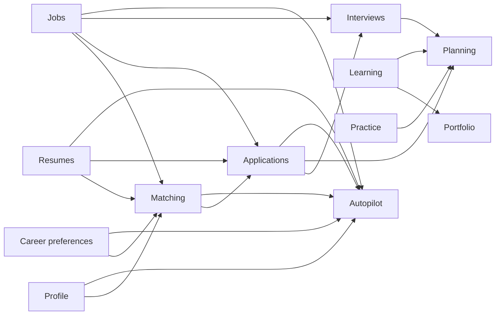

# Feature boundaries

Last verified: 2026-09-27

Status: approved target direction; not yet implemented as folders.

## Dependency rules

- A feature owns its domain validation, types, domain services, feature UI, and feature-specific server access.
- `app/` composes features and handles framework routing.
- `shared/` contains genuinely cross-feature UI/utilities without business ownership.
- `infrastructure/` contains Supabase clients, auth primitives, provider adapters, and observability—not career rules.
- Lower-level features must not import dashboard, career intelligence, or Autopilot orchestration.
- Public feature APIs should be deliberate; avoid deep imports and barrel chains created only for aesthetics.

## Proposed domains

| Domain | Owns | May depend on |
| --- | --- | --- |
| auth | Session/user lookup, OAuth flow, route protection | infrastructure/supabase |
| profile | Candidate identity facts | auth |
| career | Goals, preferences, intelligence output | profile, resumes, jobs, applications |
| resumes | Upload metadata, parsing, editing, ATS-safe content | auth, profile, infrastructure/storage |
| jobs | Global jobs, owned opportunities, ingestion | auth, infrastructure/providers |
| matching | Explainable score | profile, career preferences, resumes, jobs |
| saved-jobs | User/job relationship | auth, jobs |
| applications | Preparation, tracker, facts, follow-up | auth, jobs, resumes, matching |
| interviews | Rounds and job-grounded preparation | auth, applications, jobs, resumes |
| practice | Private practice sessions and self-review | auth, profile, resumes, jobs, learning links |
| learning | Catalog, progress, assessment, completion records | auth, profile, resumes, jobs |
| portfolio | Grounded evidence | auth, learning |
| planning | My Day ranking and deferral | applications, interviews, learning, practice, jobs |
| autopilot | Scheduled discovery/evaluation/preparation orchestration | profile, career preferences, resumes, jobs, matching, applications |

## Cross-domain consumers

Dashboard, career intelligence, and Autopilot intentionally read several domains. They are consumers/orchestrators, not foundations. A lower-level domain such as jobs, resumes, or applications must not depend on them.

## Migration constraint

Do not move all files at once. For each approved feature migration: preserve behavior, establish the current tests, move one cohesive unit, update imports, run the full relevant gate, and inspect the diff. No feature folders are created in Phase 1.
