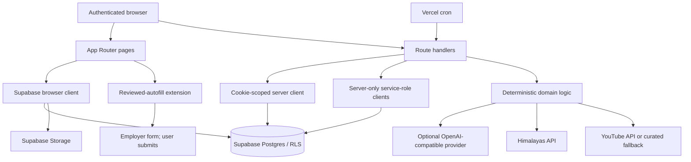

# System architecture

Last reconciled: 2026-10-08 (source and automated checks; external acceptance is separate)

## Current additions and boundaries

Current domains additionally include recruiter hiring/company verification/branding, candidate privacy/discovery, communications, notification workers, calendar OAuth/sync, admin moderation/suspension, usage/entitlements and customer billing. They reuse native route/server/RLS patterns, without new payment SDK or rendering dependency. [Complete implementation and domain map](../IMPLEMENTATION-REFERENCE.md) covers every current API and table creation. Live billing is configurable but not activated; signed-in provider acceptance and commercial hosting remain release gates.

## Overview

JobPilot is a Next.js 16 App Router application backed by Supabase and deployed on Vercel. Pages combine server and client components; route handlers expose authenticated JSON APIs. Deterministic domain modules perform matching, ATS analysis, preparation, evaluation, and planning. External AI and resource providers are optional enhancements.

## Next.js boundaries

- `app/` defines routes, layouts, pages, errors, OAuth callback, and APIs.
- `proxy.ts` refreshes Supabase sessions and redirects unauthenticated page requests. APIs deliberately return JSON auth errors themselves.
- Server components may access server-only data. Client components are treated as browser code even when initially rendered by Next.js.
- Current pages mix route composition with substantial feature UI and, in profile/resume/jobs/dashboard areas, direct Supabase access.

## Data access

Three current patterns coexist:

1. Browser client plus RLS for profile, resume, saved-job, and selected job/dashboard operations.
2. Cookie-scoped server client in APIs for authenticated user operations.
3. Service-role clients for cron, job ingestion, server-validated learning/practice writes, and public completion verification.

Service-role access bypasses RLS; each privileged path must authenticate or deliberately validate public visibility and scope all user data explicitly.

## External providers

- Himalayas supplies public job data; imported rows are global jobs.
- An OpenAI-compatible chat-completions provider can enhance interview actions.
- YouTube search can enhance resource results.
- Provider absence or failure leaves deterministic/curated behavior available.

## Background processing

Vercel calls `/api/cron/autopilot` daily at 03:00 UTC with a bearer secret. The worker pages through enabled users, attempts a feed refresh, and prepares bounded packages under a per-user active-run lock and time budget. It never silently submits employer forms.

## Browser extension

The Manifest V3 helper receives reviewed contact fields only from the configured JobPilot Applications workspace. Data is stored temporarily in browser session storage, filled only into exact empty supported fields, and removed after use/expiry. Final submission remains manual.

## Deterministic and AI behavior

Matching, ATS analysis, career intelligence, application preparation, interview generation/evaluation, planning, and most content under `lib/ai/` are deterministic TypeScript. Only provider actions routed through `lib/ai/providers/` may call external AI.

## Known architectural pressure

- Cross-domain pages and orchestrators import broad data directly.
- Data access and validation patterns are inconsistent.
- Large client pages make boundaries and testing harder.
- The approved direction is incremental feature ownership, not a mechanical move or `src/` migration.

Relevant code: `app/`, `proxy.ts`, `lib/`, `extensions/autofill/`, `vercel.json`.
