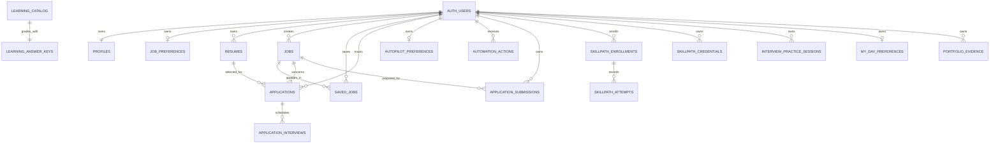

# Database architecture

Last verified: 2026-09-27

Supabase PostgreSQL stores account-owned career data, global/owned opportunities, background preparation state, learning, practice, planning, and evidence. Current migration history reconstructs locally; production is aligned through the prior baseline, with the four Phase 2 migrations intentionally pending approval.

## Entity overview

## Tables

| Table | Purpose and ownership | Important constraints / relationships |
| --- | --- | --- |
| `profiles` | One candidate profile per auth user; owner ID is primary key | Profile trigger creates initial row; bounded `application_facts` JSONB added later |
| `job_preferences` | One matching-preference row per user | Unique `user_id`, score 0–100 |
| `resumes` | User resume versions and parsed content | Owner FK; optional Storage path; primary flag is not uniquely enforced |
| `jobs` | Global external jobs and user-created opportunities | Unique external ID; `created_by null` means global; manual URL unique per owner; version/expiry for manual jobs |
| `saved_jobs` | User/job save relation | Unique `(user_id,job_id)` |
| `applications` | Current application tracker state | Unique `(user_id,job_id)`; fail-closed `saved` default; status check; optimistic version; optional resume/follow-up; no event history |
| `autopilot_preferences` | One preparation policy per user | Salary/limit/threshold checks; `auto_submit` forced false by application logic |
| `automation_actions` | Autopilot run/job action history | Status/completion consistency; one active run per user for run types |
| `application_submissions` | Prepared package/submission representation | Unique user/job; submitted state requires timestamps and HTTPS proof URL |
| `skillpath_enrollments` | Owner learning progress | Composite user/path key; bounded notes/lists; version |
| `skillpath_attempts` | Server-graded assessment history | Composite FK to enrollment; bounded answers/score |
| `skillpath_credentials` | External imports or JobPilot completion records | Trust-kind checks, optional public share, unique user/path |
| `interview_practice_sessions` | Private questions, answers and self-review | Bounded JSON, fixed modes/topics/minutes, version |
| `my_day_preferences` | Private deferrals/planning preferences | One row/user; bounded JSON; version |
| `learning_catalog` | Authenticated-readable immutable course versions | Stable ID, bounded definitions/readings/questions |
| `learning_answer_keys` | Server-only assessment keys | FK to catalog; no browser policy or privilege |
| `learning_goals` | Private learning goals | One row/user; bounded skills/minutes/version |
| `application_interviews` | Scheduled rounds and outcomes | Owner plus application FK, timezone/duration/status checks, version |
| `portfolio_evidence` | Private evidence and reviewed resume material | Owner, version, source-kind checks, unique learning source |

## RLS and policies

All public tables have RLS enabled in the final migration state. Owner tables use `auth.uid()` against `id` or `user_id`. Core-table legacy grants are revoked: authenticated clients receive only the operations used by the product, anonymous clients receive none, and `TRUNCATE` is not granted. Catalog reading is available to authenticated users. Jobs allow authenticated users to read global jobs and their own manual jobs, insert only owned `source=user` rows, and update only owned manual rows.

`learning_answer_keys` intentionally has:

- RLS enabled
- no browser RLS policy
- privileges revoked from `public`, `anon`, and `authenticated`
- service-role access only
- an accepted/intentional advisor INFO because the absence of a client policy is the design

## Jobs: global and owned

- External/global job: `created_by is null`, normally `source='himalayas'`.
- User opportunity: `created_by=auth.uid()` and `source='user'`.
- Authenticated clients cannot forge global feed jobs or update another user's/global row.
- `prevent_job_ownership_transfer` rejects changes to `created_by` even by an otherwise authorized update.

## Functions and triggers

| Function/trigger | Purpose and security |
| --- | --- |
| `set_updated_at` | Sets `updated_at` before updates; hardened fixed search path |
| `handle_new_user` / `on_auth_user_created` | `SECURITY DEFINER` trigger creates the initial profile after auth signup; direct execution revoked from `PUBLIC`, `anon`, and `authenticated` |
| `prevent_job_ownership_transfer` | Trigger rejects reassignment of manual job ownership |
| `protect_enrolled_learning_content` | Prevents update/delete of catalog/keys after enrollment; direct browser execution revoked |

## Important indexes

- Application status/user indexes and unique user/job constraint
- Job company/country/published/source indexes
- Manual-job owner URL uniqueness and owner/published index
- Saved-job user index and unique pair
- Autopilot action history/status/FK indexes plus partial one-active-run uniqueness
- Interview owner/time and application indexes
- Learning attempt owner/path and enrollment path indexes
- Practice and portfolio owner/update indexes
- Portfolio unique owner/learning-source index

## Service-role resources

The service role has explicit access required by Autopilot, catalog/answer keys, server-owned learning/practice writes, and selected worker tables. It bypasses RLS; application code must apply user scope. Secrets stay in server environment variables only.

## Resume Storage

Migration `20260927115054_create_private_resume_storage.sql` non-destructively creates or configures private bucket `resumes` with a 5 MiB limit and `application/pdf` allowlist. Authenticated browsers may insert and delete only keys under `<auth.uid()>/`; the corrective migration `20260929072412_allow_resume_delete_lookup.sql` permits owner-row selection only during Storage's bulk-delete operation because `remove()` resolves rows before deletion. Browser listing, download, and update and all anonymous access remain denied. Restrictive guards prevent unrelated permissive policies from widening access to this bucket, while service-role access continues to bypass RLS. The migrations are verified locally and await separate production approval.

## Migration history rule

Migration filenames/timestamps are production identity. Never rename, rewrite, delete, reorder, or squash an applied migration. Every future schema or Storage-policy change requires a new CLI-created migration, local reset, SQL tests, migration-list review, production dry run, and relevant advisors.

Core RLS and Storage invariants are covered by `core_user_data_security.sql` and `resume_storage_security.sql`; the latter inspects delete-policy metadata because current Supabase protects `storage.objects` from direct SQL deletion.

Relevant code: `supabase/migrations/`, `supabase/tests/`, `supabase/seed.sql`, `lib/supabase/`, `lib/learning/server.ts`.
