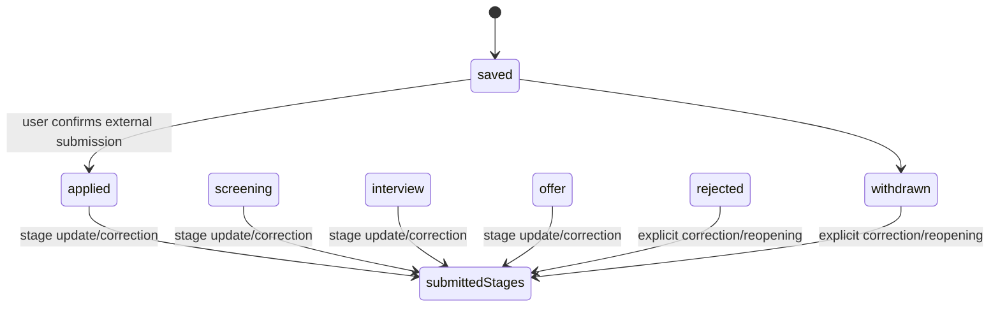

# Application Lifecycle

**Status:** Implemented locally; event history deferred
**Priority:** P0
**Last verified:** 2026-09-27

## Current behavior

`public.applications.status` accepts `saved`, `applied`, `screening`, `interview`, `offer`, `rejected` and `withdrawn`. Its database/API default is now `saved`; rows have a positive integer `version`. Ownership is enforced by user-scoped queries and RLS.

The implemented lifecycle is fail-closed:

- `POST /api/applications` creates `saved` when status is absent; a new `applied` row requires `submissionConfirmed: true`.
- An existing `saved` record advances only to `applied` with explicit confirmation and the reviewed version, or to `withdrawn` through PATCH.
- `PATCH /api/applications` requires and conditionally updates the current version; stale mutations return `409`.
- The Applications UI offers only transitions accepted by the shared lifecycle module.
- Autopilot creates `application_submissions.status = 'prepared'` and a tracker row with `applications.status = 'saved'`. User confirmation changes the tracker to `applied`.
- Follow-up and interview records are related behavior, but they do not currently enforce tracker transitions.

`prepared` is deliberately not an application status. It describes an application package. `saved` means the external application has not been confirmed as submitted.

## Implemented transition graph

`submittedStages` means any status except `saved`. Corrections and reopenings remain possible because the existing UI supported them; no submitted record can return to `saved`. An accepted-offer state remains out of scope until the product defines that outcome.

## Implemented enforcement

1. Migration `20260927121403_harden_application_lifecycle.sql` changes the default to `saved` and adds `version`.
2. `lib/applications/lifecycle.ts` centralizes current statuses and transitions for API and UI.
3. Application updates filter by `id`, `user_id`, and version, then increment version.
4. `submissionConfirmed: true` is required server-side for initial or existing `saved → applied` submission.
5. `applied_at` is set once when submission is first confirmed and is preserved later.

## Fail-closed behavior

- Unknown state or transition: `400`.
- Stale expected version: `409`, with instructions to reload.
- Missing explicit submission confirmation: remain `saved`.
- Failed related write: do not claim the new state unless the authoritative application update succeeded.
- Duplicate confirmation: return the existing applied record without changing `applied_at`.

## Future history

When lifecycle history becomes a product requirement, add append-only `application_events` with application ID, user ID, from/to states, event type, actor, timestamp and optional reason. Until then, current state plus optimistic concurrency is the smaller implementation.

## Migration and rollout outline

1. Inventory every status-writing path and add contract tests for the current human-confirmation boundary.
2. Add optimistic concurrency and the shared transition validator without changing stored rows.
3. Change the default to fail closed.
4. Update the UI to offer only legal next states and handle `409` conflicts.
5. Add SQL tests for valid, invalid and cross-user transitions if enforcement moves into the database.
6. Roll out behind normal deployment monitoring; do not rewrite historical statuses without a separately reviewed data plan.
