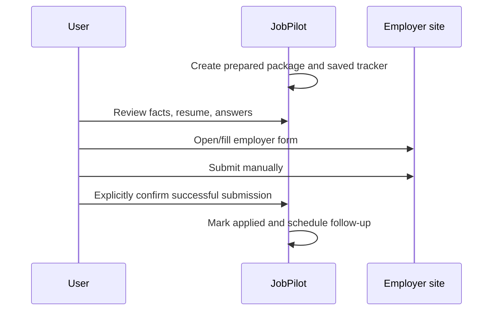

# Application flow

Last verified: 2026-09-27

## Entry condition

An authenticated user selects a visible job from Jobs, Saved Jobs, Copilot, Autopilot, or the application pipeline.

## Core invariant

**PREPARED != SUBMITTED.** A generated package, opened employer link, copied answer, or autofilled field is not proof of submission. Only explicit user confirmation should represent application submission.

Routes: `/applications`, `/jobs/[id]`, `/jobs/[id]/copilot`. APIs: `/api/applications`, `/api/applications/answers`, `/api/jobs/save`, `/api/interviews`.

Database effects: `application_submissions` stores prepared packages; `applications` stores current tracker state; confirmed reusable facts update `profiles.application_facts`; interviews use `application_interviews`.

Security checks: authentication, RLS/owner filters, owned-resume validation, bounded notes/facts, centralized legal transitions, explicit server-validated submission intent, optimistic application versions, exact contact allowlist in the optional extension, and explicit confirmation prompt.

Failure states: missing resume/facts/job link, invalid transition, stale application/facts/interview tab, save/provider failure, blocked employer framing, extension permission denial, or unverified employer submission. Copy/paste remains available.

Current lifecycle: missing status and the table default both resolve to `saved`. New `applied` records and `saved → applied` require explicit submission confirmation. `saved` may otherwise become `withdrawn`; it cannot skip to later stages, and submitted records cannot return to `saved`. Corrections and reopenings among already-submitted stages remain allowed. Mutations compare/increment `version`; complete transition history is not stored.

Exit condition: package remains prepared/saved, or the user explicitly confirms submission and the tracker records `applied` with a follow-up. JobPilot confirmation is user-reported, not provider proof.
