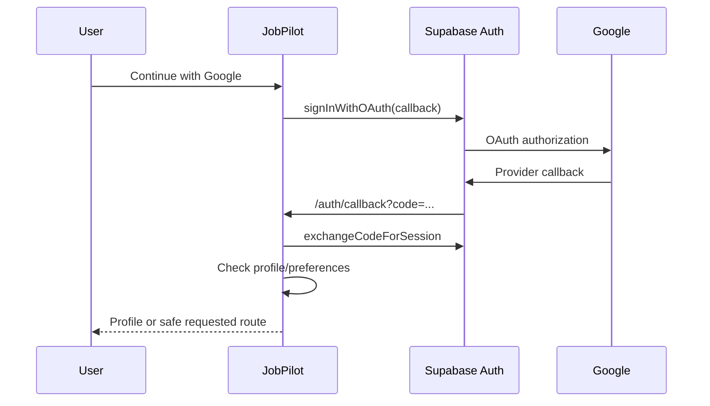

# Authentication flow

Last verified: 2026-09-27

## Entry condition

An unauthenticated visitor chooses Google sign-in at `/auth/login`, or requests a protected page and is redirected there by `proxy.ts` with a safe `next` path.

## Steps

Routes: `/auth/login`, `/auth/callback`, requested protected route. API call: Supabase Auth SDK; no JobPilot JSON API.

Database effects: `handle_new_user` creates `profiles`; callback reads `profiles` and `job_preferences`. Security: canonical callback origin, internal-only `next`, server code exchange, protected-page proxy, and server-side API authentication.

Failure states: provider cancellation, missing/invalid code, missing production site URL, session exchange failure, or profile read failure. Failures return to Login with a stable code; they do not expose provider details.

Exit condition: an authenticated session exists and the user reaches Profile when required fields/preferences are incomplete, otherwise the safe requested route or Dashboard. Current UI supports Google OAuth only.
