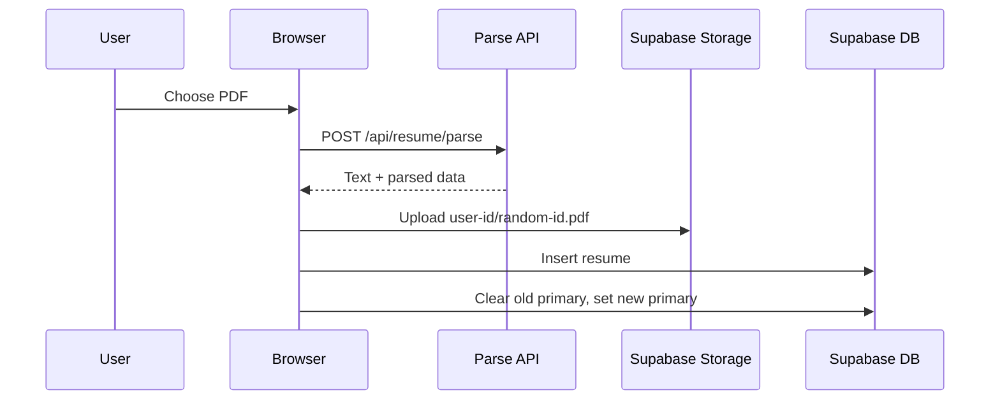

# Resume flow

Last verified: 2026-09-27

## Entry condition

An authenticated user opens `/resume` with or without an existing primary resume.

## Steps

The user may edit parsed sections at `/resume`, create a tailored copy in `/resume/studio`, run deterministic ATS analysis, apply safe grounded suggestions, and export HTML/print-to-PDF.

Database effects: `resumes` insert/update/delete; original PDF in private `resumes` Storage bucket. Saved jobs may provide target descriptions in Studio.

Security checks: authenticated parse, PDF MIME and 5 MiB limit, non-empty/250,000-character extracted text, owner RLS, private bucket constraints, and owner-prefix Storage policies. Browser clients receive insert/delete only for their own prefix; list/read/update and anonymous access are denied.

Failure states: image-only/unreadable PDF, oversized/invalid file, unapplied production Storage migration, parse/upload/database failure, or non-atomic primary switch failure. Cleanup attempts remove partially inserted file/row.

Exit condition: an owner resume is primary or a tailored copy is saved/exported. ATS output is guidance and never proof of acceptance. The repository now reproduces Storage locally; production rollout remains separately approved.
